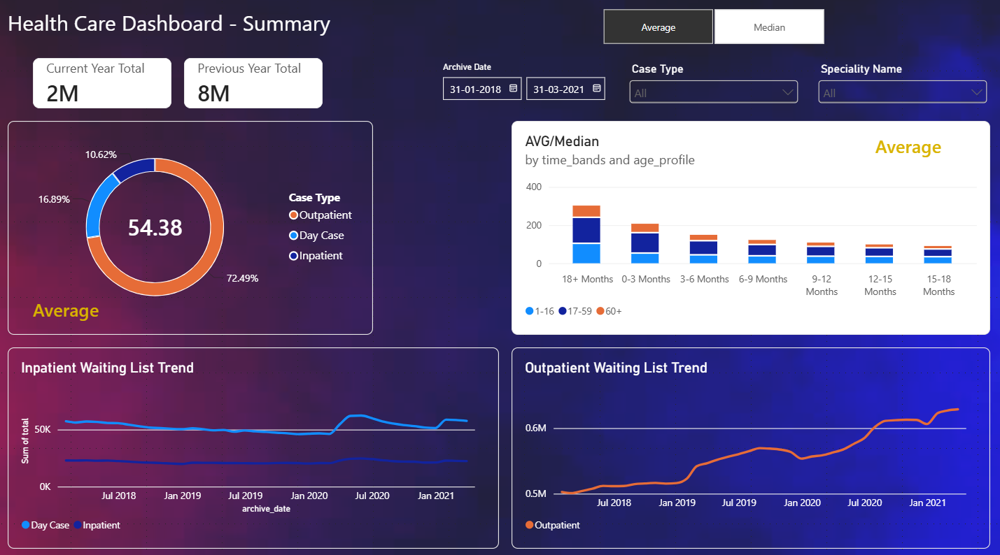
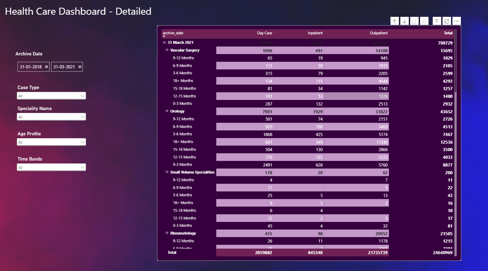

# Power BI - Healthcare - Patient Waitlist Dashboard

## Business Objective

Management needs a reporting and analytics dashboard to track the current status of the patient waiting list. Stakeholders also need to understand the historical monthly trends in the waiting list across inpatient and outpatient departments, along with detailed analysis at the speciality and age-profile levels.

## Dataset

**Healthcare data - Patient waitlist**

* **Inpatient data:** A patient who stays in a hospital while under treatment.

* **Outpatient data:** A patient who receives medical treatment without being admitted to a hospital.

* [Inpatient Data](data/Inpatient/)

* [Outpatient Data](data/Outpatient/)

* [Mapping Specialty](data/Mapping_Specialty.csv)

## Workflow Steps

* Requirement Gathering
* Requirement Analysis
* Blueprint of Execution Workflow
* Project Structure
* Designing Architecture
* Ingestion Pipeline
* EDA Analysis
* Transformation Pipeline
* Data Visualization Blueprint
* Dashboard Layout & Design
* Interactivity & Navigation
* Testing
* Sharing
* Maintenance & Refresh

## Step 1: Requirement Gathering

### Problem Statement

1. Track the current status of the patient waiting list.
2. Analyze historical monthly trends of the waiting list for:

   * Inpatient Department
   * Outpatient Department

### Data Sources

1. Inpatient data folder
2. Outpatient data folder
3. Specialty mapping file

### Access

1. Access to the data sources has been shared with the Data Engineering team.
2. Access to the scripts and dashboard should be provided only to the required stakeholders.
3. Access will be managed through the company group email address.

### Audiences

1. Project Stakeholders
2. Client

### Metrics & KPIs

1. Discussion and finalization of important KPIs.
2. Dashboard blueprint and layout.

### Project Completion Timeline

* 1 week

## Step 2: Requirement Analysis

### Inpatient Folder

Contains 4 CSV files:

* IN_WL 2018
* IN_WL 2019
* IN_WL 2020
* IN_WL 2021

### Outpatient Folder

Contains 4 CSV files:

* Op_WL 2018
* Op_WL 2019
* Op_WL 2020
* Op_WL 2021

### Specialty Mapping

* Mapping_Specialty.csv
* During the ingestion process, the mapping columns are standardized to match the SQL Server table.

### Definitions

* **Inpatient:** A patient who stays in a hospital while under treatment.
* **Outpatient:** A patient who receives medical treatment without being admitted to a hospital.

### Notebook Analysis

* [Analysis Inpatient Data](notebook/analysis_inpatient_data.ipynb)
* [Analysis Outpatient Data](notebook/analysis_outpatient_data.ipynb)

### Findings

* Inpatient files have 8 columns.
* Outpatient files have 7 columns.
* The mapping file has 2 columns.
* Inpatient and outpatient datasets have similar structures, except the `Case_Type` column is present in the inpatient dataset and not in the outpatient dataset.

## Step 3: Blueprint of Execution Workflow

### Source Data Processing

* Read files from the `inpatient` folder using Python and merge them into `merged_data/`.

  * `inpatient_data.csv`
* Read files from the `outpatient` folder using Python and merge them into `merged_data/`.

  * `outpatient_data.csv`

### Database and Schema

Create the `HealthCareDB` database with the following schemas:

* `bronze`
* `silver`
* `gold`

### Bronze Layer

Create the following Bronze tables:

* `bronze.inpatientdata`
* `bronze.outpatientdata`:wq
* `bronze.speciality_mapping`

Load the source data into the Bronze Layer using Python:

* `inpatient_data.csv` → `bronze.inpatientdata`
* `outpatient_data.csv` → `bronze.outpatientdata`
* `Mapping_Specialty.csv` → `bronze.speciality_mapping`

### Silver Layer

* Create `silver.patientwaitlistdata`.
* Transform and integrate data from:

  * `bronze.inpatientdata`
  * `bronze.outpatientdata`
  * `bronze.speciality_mapping`
* Create the Silver Layer stored procedure:

  * `silver.load_silver`

### Gold Layer

* Create the business-ready Gold View:

  * `gold.patientwaitlistdata`

The Gold layer is implemented as a SQL Server view, so no separate physical load is required.

## Step 4: Project Structure

```text
Health-Care/
│
├── data/
│   ├── Inpatient/
│   ├── Outpatient/
│   └── merged_data/
│
├── docs/
├── scripts/
├── notebook/
├── sql/
├── venv/
│
├── .gitignore
├── config.py
├── README.md
└── requirements.txt
```

## Step 5: Development Tools & Infrastructure

* Python
* Jupyter Notebook
* Visual Studio Code
* SQL Server Management Studio
* SQL
* Git
* GitHub
* Draw.io
* Power BI

## Step 6: Designing Architecture

Design architecture is important because it provides a clear blueprint of the entire solution. It helps us understand the end-to-end process flow, identify the steps that need to be executed, determine how different components interact with each other, and select the appropriate tools and platforms for implementation.

* [High Level Architecture](docs/High-Level-Architecture.png)
* [Data Flow Architecture](docs/Data%20Architecture-Layers.png)
* [Data Flow Diagram](docs/Dashboard-Data%20Flow%20Diagram.png)

## Step 7: Ingestion Pipeline

### Step 1: Environment Setup

Using VS Code:

* Create the project folder structure.
* Verify Python and pip versions.
* Install required packages:

```bash
pip install pandas pyodbc sqlalchemy
```

* Generate/update `requirements.txt`:

```bash
pip freeze > requirements.txt
```

### Step 2: Merge Source Data

Python scripts merge the yearly source files into consolidated datasets.

* [Merge Inpatient Data](scripts/merge_inpatient_data.py)
* [Merge Outpatient Data](scripts/merge_outpatient_data.py)

Output:

```text
data/merged_data/
├── inpatient_data.csv
└── outpatient_data.csv
```

### Step 3: Create Database & Schemas

SQL Server is used to create the database and required schemas.

* [Database & Schema](sql/init_database_schema.sql)

Database:

```text
HealthCareDB
```

Schemas:

```text
bronze
silver
gold
```

### Step 4: Create Bronze Tables

SQL Server is used to create the Bronze tables.

* [Bronze Tables SQL Scripts](sql/ddl_bronze_layer.sql)

Tables:

* `bronze.inpatientdata`
* `bronze.outpatientdata`
* `bronze.speciality_mapping`

### Step 5: Load Raw Data into Bronze

Python is used to load the merged/source data into SQL Server Bronze tables.

* [Load Inpatient Data](scripts/load_inpatient_sql.py)
* [Load Outpatient Data](scripts/load_outpatient_sql.py)
* [Load Specialty Mapping Data](scripts/load_speciality_mapping.py)

The Bronze loading process truncates the existing Bronze tables and reloads the latest source data.

### Step 6: Verify the Data

Verify the following Bronze tables after loading:

* `bronze.inpatientdata`
* `bronze.outpatientdata`
* `bronze.speciality_mapping`

## Step 8: Exploratory Data Analysis

The datasets were analyzed using Python and Jupyter Notebook to understand:

* Data structure

* Data types

* Missing values

* Duplicate records

* Value distributions

* Business rules

* Data quality issues

* Inpatient and outpatient differences

* [EDA Findings](docs/EDA_Findings.md)

## Step 9: Transformation Pipeline

### Silver Layer

The Silver Layer cleans, standardizes, transforms, and integrates data from the Bronze Layer.

* [Silver Layer DDL](sql/ddl_silver_layer.sql)
* [Silver Layer Transformation](sql/load_silver.sql)

Stored Procedure:

```sql
silver.load_silver
```

The Silver Layer combines the inpatient and outpatient datasets and applies the required transformations and standardization rules.

### Gold Layer

The Gold Layer provides the final business-ready dataset for Power BI.

* [Gold Layer View](sql/load_gold.sql)

Gold View:

```sql
gold.patientwaitlistdata
```

The Gold layer is implemented as a view over the Silver Layer and specialty mapping, allowing Power BI to access the latest transformed data without requiring a separate physical Gold table load.

## Step 10: Automation Pipeline

The complete data pipeline is automated using Python and SQL Server Stored Procedures.

### Python Automation

* [Main Pipeline](scripts/main.py)

The `main.py` script acts as the pipeline orchestrator and executes the complete workflow in the required sequence.

### Automated Execution Flow

```text
1. Merge Inpatient CSV files
        ↓
2. Merge Outpatient CSV files
        ↓
3. Load Inpatient → Bronze
        ↓
4. Load Outpatient → Bronze
        ↓
5. Load Specialty Mapping → Bronze
        ↓
6. Execute dbo.sp_load
        ↓
7. Silver Layer
        ↓
8. Gold View
        ↓
9. Power BI
```

### Run the Complete Pipeline

From the project root:

```bash
python -m scripts.main
```

The pipeline stops if an error occurs in any stage, preventing the downstream Silver/Gold processing from executing against an incomplete Bronze load.

### Master Stored Procedure

* [Master Load Procedure](sql/sp_load.sql)

Stored Procedure:

```sql
dbo.sp_load
```

The master stored procedure executes the Silver Layer loading procedure:

```sql
EXEC silver.load_silver;
```

The Gold layer does not require a physical load because `gold.patientwaitlistdata` is a view.

## Pipeline Validation

The automated pipeline was successfully executed and validated.

### Bronze Layer

| Table                       |    Rows |
| --------------------------- | ------: |
| `bronze.inpatientdata`      | 182,136 |
| `bronze.outpatientdata`     | 270,983 |
| `bronze.speciality_mapping` |      78 |

### Silver & Gold Layer

| Layer                        |    Rows |
| ---------------------------- | ------: |
| `silver.patientwaitlistdata` | 453,119 |
| `gold.patientwaitlistdata`   | 453,119 |

The Silver and Gold row counts match, confirming that the Gold View is exposing the complete Silver dataset.

## Power BI Dashboard

### Summary Page



### Detail Page


